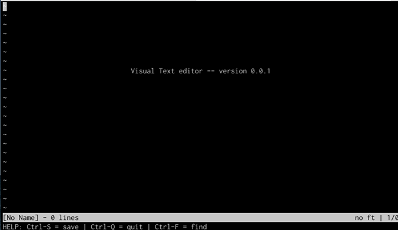

# 📝 VITE - Visual Text Editor

> **C언어 기반 콘솔 텍스트 에디터 구현 프로젝트**  
> 자료구조와 터미널 제어를 활용하여 vi editor와 유사한 기본 편집 기능을 구현했습니다.

---

## 📌 Project Overview

**VITE(Visual Text Editor)**는 C언어로 구현한 콘솔 기반 텍스트 에디터입니다.

본 프로젝트는 자료구조 수업에서 학습한 개념을 실제 프로그램에 적용하기 위해 진행되었습니다.  
텍스트 파일을 행 단위로 관리하고, 사용자의 키 입력에 따라 문자 입력, 삭제, 줄 나누기, 커서 이동, 파일 저장 등의 기능을 수행하도록 구현했습니다.

vi editor와 유사한 형태의 텍스트 에디터를 목표로 하되,  
vi처럼 입력 모드를 전환하지 않고 키보드 입력을 통해 바로 텍스트를 수정할 수 있도록 설계했습니다.

---

## 🖼️ Preview

<p align="center">
  
</p>

<p align="center">
  <em>VITE text editor execution example</em>
</p>

---

## 🎯 Project Goal

본 프로젝트의 주요 목표는 다음과 같습니다.

- C언어 기반 콘솔 텍스트 에디터 구현
- 텍스트 버퍼 자료구조 설계
- 이중 연결 리스트를 활용한 행 단위 텍스트 관리
- 파일 열기 및 저장 기능 구현
- 커서 이동 및 특수키 처리
- 상태바와 메시지바를 포함한 터미널 UI 구성
- 동적 메모리 할당 및 해제 관리
- Windows, Linux, macOS 환경을 고려한 전처리 및 빌드 구성

---

## 🛠️ Development Environment

| Category | Description |
|---|---|
| Language | C |
| UI Library | curses / PDCurses |
| Build Tool | Makefile |
| Supported OS | Windows, Linux, macOS |
| Compiler | GCC / MinGW |

---

## ⚙️ Build & Run

### 1. Build

프로젝트는 `makefile`을 통해 컴파일할 수 있습니다.

Linux / macOS 환경에서는 다음 명령어를 사용합니다.

```bash
make
```

Windows 환경에서는 MinGW를 기준으로 다음 명령어를 사용할 수 있습니다.

```bash
mingw32-make
```

---

### 2. Run

새 파일을 생성하여 실행할 경우:

```bash
./vite
```

기존 파일을 열 경우:

```bash
./vite filename.txt
```

예시:

```bash
./vite vite.c
```

---

## 💻 Cross-platform Support

본 프로젝트는 Windows, Linux, macOS 환경에서 실행될 수 있도록 운영체제별 전처리를 적용했습니다.

### Windows

Windows 환경에서는 같은 디렉터리에 PDCurses 관련 파일이 존재한다고 가정하고 컴파일되도록 구성했습니다.

Windows에서 주요 키 입력 값은 다음과 같이 처리했습니다.

| Key | ASCII / Code |
|---|---|
| Enter | 13 |
| Backspace | 8 |
| Delete | 127 |

---

### Linux

Linux 환경에서는 기본 제공되는 curses 라이브러리를 사용하며, `-lncurses` 옵션을 통해 컴파일되도록 구성했습니다.

| Key | ASCII / Code |
|---|---|
| Enter | 10 |
| Backspace | 8 |
| Delete | 127 |

---

### macOS

macOS 역시 curses 기반으로 동작하도록 구성했습니다.

일부 특수키는 터미널 환경에 따라 입력 처리가 달라질 수 있어, 다음과 같은 단축키 방식으로 매핑했습니다.

| Function | Key |
|---|---|
| Page Up | Ctrl + U |
| Page Down | Ctrl + D |
| Home | Ctrl + H |
| End | Ctrl + E |

---

## 🧱 Data Structure

### Doubly Linked List 기반 Text Buffer

VITE는 텍스트 파일의 각 행을 **이중 연결 리스트(Doubly Linked List)** 구조로 관리합니다.

각 노드는 하나의 행을 의미하며, 현재 행의 문자열과 문자열 길이를 저장합니다.

```c
typedef struct Node {
    char *str;
    int strsize;
    struct Node *up;
    struct Node *down;
} Node;
```

각 노드는 위쪽 행과 아래쪽 행을 가리키도록 설계했습니다.

- `up`: 이전 행
- `down`: 다음 행
- `str`: 현재 행의 문자열
- `strsize`: 현재 행 문자열의 길이

이 구조를 통해 행 단위 삽입, 삭제, 이동을 구현했습니다.

---

## 🧩 Core Features

### 1. File Open

기존 파일을 열 경우 `fopen`을 사용하여 파일을 읽고,  
`getline`을 통해 한 줄씩 읽어 각 행을 노드로 변환합니다.

읽어온 각 줄은 텍스트 버퍼에 저장되며,  
개행 문자는 화면 출력 과정에서 처리하기 위해 문자열 내부에서는 제거했습니다.

```c
FILE *fp = fopen(filename, "r");
```

파일을 지정하지 않고 실행할 경우 기본 빈 에디터 화면을 출력합니다.

---

### 2. Text Editing

VITE는 입력된 문자를 현재 커서 위치에 삽입할 수 있도록 구현했습니다.

지원하는 편집 기능은 다음과 같습니다.

- 문자 입력
- Backspace
- Delete
- Enter를 통한 줄 나누기
- 행 중간에서 Enter 입력 시 새로운 노드 삽입
- 행의 맨 앞에서 삭제 시 현재 노드 삭제 및 행 병합 처리

문자열 수정 시에는 `realloc`을 사용하여 문자열 크기를 동적으로 조절했습니다.

문자가 추가될 때마다 문자열 크기를 증가시키고,  
삭제될 때에는 문자열 크기를 줄이며 배열 내부 문자를 이동시켜 수정 결과를 반영했습니다.

문자열 마지막에 `'\0'`을 유지하기 위해 필요한 크기보다 1바이트를 추가로 확보했습니다.

---

### 3. Cursor Movement

다음 키 입력을 통해 커서 이동을 지원합니다.

| Key | Function |
|---|---|
| Arrow Left | 왼쪽 이동 |
| Arrow Right | 오른쪽 이동 |
| Arrow Up | 위쪽 행 이동 |
| Arrow Down | 아래쪽 행 이동 |
| Home | 현재 행의 처음으로 이동 |
| End | 현재 행의 끝으로 이동 |
| Page Up | 파일 최상단으로 이동 |
| Page Down | 파일 최하단으로 이동 |

좌우 이동의 경우, 현재 행의 끝이나 처음에서 한 번 더 이동하면 다음 행 또는 이전 행으로 이동하도록 구현했습니다.

상하 이동의 경우, 파일의 최상단 또는 최하단에서는 더 이상 이동하지 않도록 처리했습니다.

---

### 4. Status Bar

상태바는 화면 아래에서 두 번째 줄에 표시됩니다.

상태바에는 다음 정보가 출력됩니다.

- 파일 이름
- 전체 라인 수
- 현재 커서가 위치한 라인 번호
- 현재 커서 위치

상태바는 `curses`의 반전 색상 기능을 활용하여 일반 텍스트 영역과 구분되도록 구현했습니다.

```c
attron(A_REVERSE);
```

---

### 5. Message Bar

메시지바는 화면 가장 아래 줄에 표시됩니다.

초기 메시지바에는 기본 사용법을 안내합니다.

- 저장: Ctrl + S
- 나가기: Ctrl + Q

프로그램 사용 중에는 저장 완료, 종료 경고 등 상황에 따른 메시지를 출력합니다.

---

### 6. Save

파일 저장은 `Ctrl + S` 입력을 통해 수행됩니다.

기존 파일을 열어 수정한 경우 현재 파일명으로 저장하고,  
새 파일인 경우 파일 이름을 입력받은 후 저장합니다.

저장은 연결 리스트의 각 노드를 순회하면서 한 줄씩 파일에 기록하는 방식으로 구현했습니다.

```c
FILE *fp = fopen(filename, "w");
fputs(cur->str, fp);
```

각 행을 저장한 뒤 직접 개행 문자를 추가하여 원래 텍스트 파일 형태로 저장되도록 했습니다.

파일 저장이 완료되면 저장 상태를 추적하는 변수를 갱신하여,  
이후 종료 시 저장 여부를 판단할 수 있도록 했습니다.

---

### 7. Quit

프로그램 종료는 `Ctrl + Q` 입력으로 수행됩니다.

파일이 저장된 상태라면 한 번의 `Ctrl + Q` 입력으로 종료됩니다.

파일이 저장되지 않은 상태라면 실수로 종료되는 것을 방지하기 위해 경고 메시지를 출력하고,  
`Ctrl + Q`를 추가로 입력해야 종료되도록 구현했습니다.

```text
Ctrl-Q를 두 번 더 누르세요.
```

---

## 🖥️ User Interface

VITE의 화면은 크게 세 영역으로 구성됩니다.

```text
+--------------------------------+
|                                |
|          Text Area             |
|                                |
+--------------------------------+
| filename | line | cursor info  |  <- Status Bar
| Ctrl-S Save | Ctrl-Q Quit      |  <- Message Bar
+--------------------------------+
```

텍스트 영역에는 파일 내용이 출력되고,  
아래쪽 두 줄에는 상태바와 메시지바가 표시됩니다.

---

## 🔍 Key Implementation Details

### 1. Text Buffer

텍스트 파일의 각 행을 이중 연결 리스트의 노드로 저장했습니다.  
이를 통해 행 단위 삽입, 삭제, 이동을 구현했습니다.

---

### 2. Dynamic Memory Allocation

문자 입력과 삭제가 발생할 때마다 문자열 크기를 조절하기 위해 `malloc`, `realloc`, `free`를 사용했습니다.

특히 문자열 수정 시 다음 사항을 고려했습니다.

- 문자 삽입 시 문자열 크기 증가
- 문자 삭제 시 문자열 크기 감소
- 배열 내부 문자 이동
- 문자열 마지막의 `'\0'` 유지

---

### 3. Re-rendering

초기에는 수정이 발생한 라인만 다시 출력하는 방식을 고려했습니다.

하지만 커서 이동, 행 삭제, 행 삽입, 화면 스크롤 등에서 고려해야 할 조건이 많아졌고,  
최종적으로는 화면 상태가 변경될 때 전체 콘솔을 다시 출력하는 방식의 `rePrintConsole` 함수를 구현했습니다.

이를 통해 다양한 입력 상황에서 일관된 화면 출력을 유지할 수 있도록 했습니다.

---

### 4. Keyboard Input Handling

`getch()`를 사용하여 입력 값을 읽고,  
입력된 값이 일반 문자, 특수키, 제어키인지 구분하여 각각 다른 동작을 수행하도록 구현했습니다.

처리한 주요 입력은 다음과 같습니다.

- 일반 문자
- Enter
- Backspace
- Delete
- Arrow Key
- Home
- End
- Page Up
- Page Down
- Ctrl + S
- Ctrl + Q

---

### 5. File Save Logic

저장 시에는 현재 연결 리스트의 head부터 마지막 노드까지 순회하며 각 행의 문자열을 파일에 기록합니다.

각 노드의 문자열을 저장한 뒤 개행 문자를 직접 추가하여 텍스트 파일의 줄 구조를 유지했습니다.

---

## ✅ Implemented Features

- [x] 새 파일 생성
- [x] 기존 파일 열기
- [x] 텍스트 입력
- [x] 줄바꿈
- [x] Backspace / Delete
- [x] 방향키 이동
- [x] Home / End
- [x] Page Up / Page Down
- [x] 상태바 출력
- [x] 메시지바 출력
- [x] 파일 저장
- [x] 저장 여부 추적
- [x] 종료 경고
- [x] 동적 메모리 관리
- [x] Windows / Linux / macOS 대응

---

> Windows 환경에서 사용하는 PDCurses 관련 파일은 필요에 따라 포함할 수 있습니다.

---

## 🧠 What I Learned

이 프로젝트를 통해 단순한 알고리즘 구현을 넘어,  
자료구조가 실제 프로그램 내부에서 어떻게 사용되는지 경험할 수 있었습니다.

특히 텍스트 에디터는 사용자의 입력에 따라 문자열 삽입, 삭제, 행 분리, 행 병합, 커서 이동, 화면 갱신이 지속적으로 발생하기 때문에,  
텍스트 데이터를 어떤 구조로 관리할 것인지가 프로그램 전체 설계에 큰 영향을 준다는 점을 확인했습니다.

또한 운영체제별 키 입력 값과 터미널 동작 방식이 다르기 때문에,  
크로스 플랫폼 콘솔 프로그램을 구현할 때 입력 처리와 빌드 환경을 분리해서 고려해야 한다는 점도 배울 수 있었습니다.

---

## 📚 Keywords

- C
- Data Structure
- Doubly Linked List
- Text Buffer
- Terminal UI
- curses
- PDCurses
- File I/O
- Dynamic Memory Allocation
- Console Editor
- Keyboard Input Handling
- Cross-platform Build# VisualText-Editor-vite-
# VisualText-Editor-vite-
# VisualText-Editor-vite-
# VisualText-Editor-vite-
# VisualText-Editor-vite-
